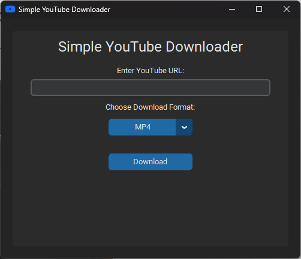

# Simple YouTube Downloader

This tool provides a user-friendly a graphical user interface (GUI) that allows you to download YouTube videos in either MP4 or MP3 format.



## Features

- Easy-to-use graphical interface.
- Download YouTube videos in MP4 or MP3 format.
- Choose download location.

## Usage

1. Launch the application.
2. Copy the URL of the YouTube video you want to download.
3. Paste the URL into the application.
4. Select the desired format (MP4 or MP3).
5. Click the "Download" button.
6. Choose download location and file name.

## Build from Source

If you want to build the application from the source code, follow these steps:

1. Clone this repository:

   ```sh
   git clone https://github.com/DaveHigs/SimpleYTDownloader
   ```

2. Navigate to the project directory:

```sh
cd SimpleYTDownloader
```

3. Install the dependencies:

```sh
poetry install
```

4. Run the application:

```sh
poetry run python main.py
```

## License

This project is licensed under the MIT License - see the [LICENSE](LICENSE) file for details.